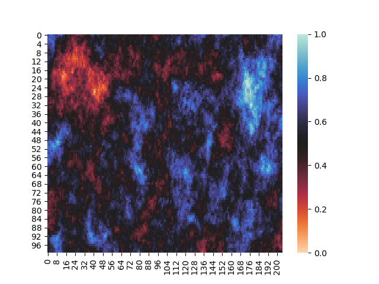
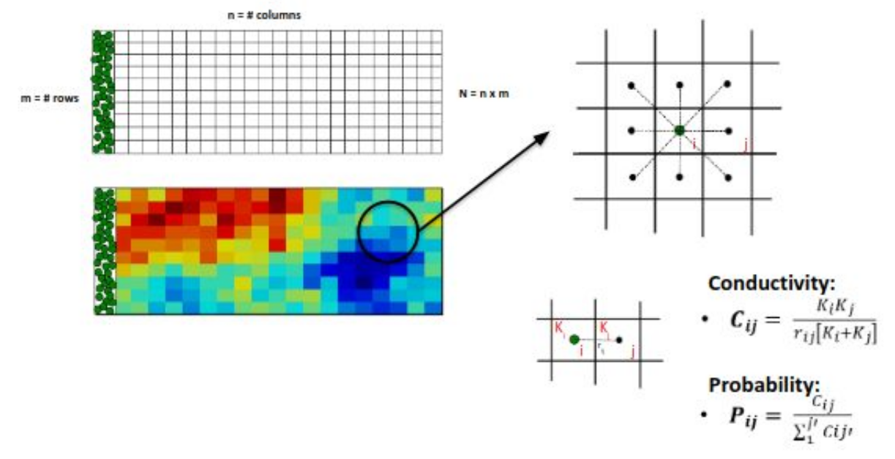
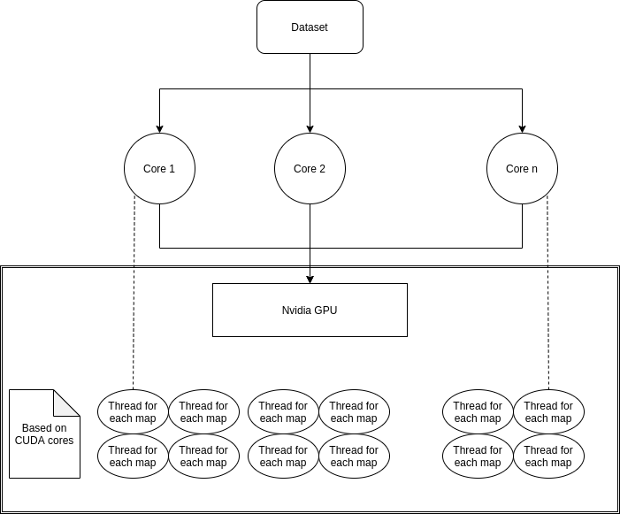
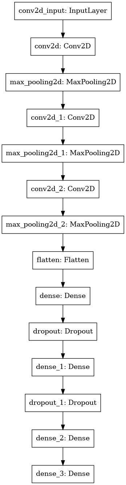
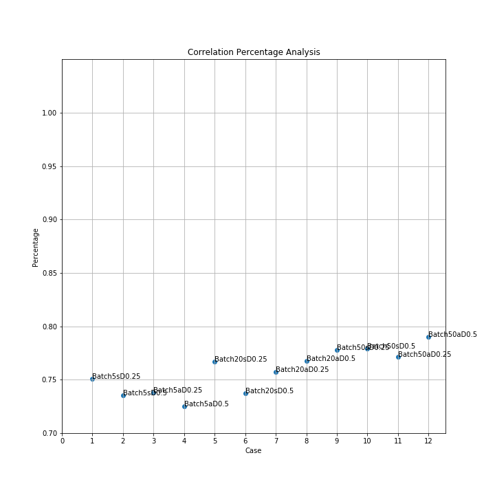
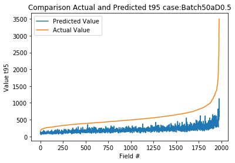
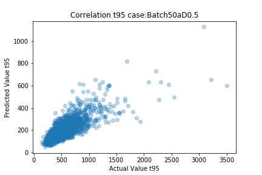

# Estimating Late Arrival Time for a Hydraulic Conductivity Map

Exploring different techniques to get insights from Hydraulic conductivity map for a relationship between t_95.

- HCM : Hydraulic Conductivity Map

## Introduction

***



## Running the program

1. Run the below command to train the Neural Network

    ```bash
    make train-nn3
    ```

2. It will generate some result folders
    1. weights: trained model weights.
    2. model: trained model in hdf5 format.
    3. performance: performance and predictions of trained model.
        - shows the results of all the data
        - shows the result of custom records, with the suffix *_Custom*.
    4. layers: Images of the layer generated for each custom record.

## Previous Work

***

### Research Papers

1. [Seeing macro-dispersivity from hydraulic conductivity field with convolutional neural network](https://www.sciencedirect.com/science/article/abs/pii/S0309170819308607)
2. [Minimum Hydraulic Resistance and Least Resistance Path in Heterogeneous Porous Media](https://agupubs.onlinelibrary.wiley.com/doi/full/10.1002/2017WR020418)

## Approach

***

## Probabilistic path estimation

***



- We define the tendency of the contaminant to pass from the cell i to one of the 8 neighbor cells j as CONDUCTIVITY, ​ **C_ij**, where rij is the distance between the two cells and Ki and Kj are the hydraulic conductivity of the considered cells. While, ​ **P_ij** ​ is the probability that the contaminant contained in the i-th cell moves in the j-th cell (that is one of the 8 cells around i).

- To generate data for all the maps in dataset it takes >2 minutes.
- To improve the performance we parallelized the code using OMP and OpenMP, based on the below structure to generate probilistic paths.



## Comparing t_95 of different HCM

***



- We create a DNN (deep neural network) with a combination of CNN (convolution neural network) and fully connected layer.
- Below is the model summary,

```bash
Model: "sequential"
_________________________________________________________________
Layer (type)                 Output Shape              Param #   
=================================================================
conv2d (Conv2D)              (None, 50, 103, 16)       800       
_________________________________________________________________
max_pooling2d (MaxPooling2D) (None, 25, 51, 16)        0         
_________________________________________________________________
conv2d_1 (Conv2D)            (None, 25, 51, 64)        50240     
_________________________________________________________________
max_pooling2d_1 (MaxPooling2 (None, 12, 25, 64)        0         
_________________________________________________________________
conv2d_2 (Conv2D)            (None, 12, 25, 128)       401536    
_________________________________________________________________
max_pooling2d_2 (MaxPooling2 (None, 6, 12, 128)        0         
_________________________________________________________________
conv2d_3 (Conv2D)            (None, 6, 12, 256)        819456    
_________________________________________________________________
max_pooling2d_3 (MaxPooling2 (None, 3, 6, 256)         0         
_________________________________________________________________
flatten (Flatten)            (None, 4608)              0         
_________________________________________________________________
dense (Dense)                (None, 256)               1179904   
_________________________________________________________________
dropout (Dropout)            (None, 256)               0         
_________________________________________________________________
dense_1 (Dense)              (None, 256)               65792     
_________________________________________________________________
dropout_1 (Dropout)          (None, 256)               0         
_________________________________________________________________
dense_2 (Dense)              (None, 512)               131584    
_________________________________________________________________
dense_3 (Dense)              (None, 1)                 513       
=================================================================
Total params: 2,649,825
Trainable params: 2,649,825
Non-trainable params: 0
_________________________________________________________________
```

## Results

We ran the system for different permutations of dropout rate and batch size for a dataset breakdown of 60% 20% 20%. Below are the results,

### Correleration

 \

### Actual v/s Predicted for best model

 \

### Correleration of Best model

 \

---

**Credits**

1. Antariksh Narain *Computer Science Graduate Student, USC*
2. Maria Morvillo *Environmental Engineering PhD. Student, USC*
3. Alessandra Bonazzi *Environmental Engineering PhD. Student, USC*
